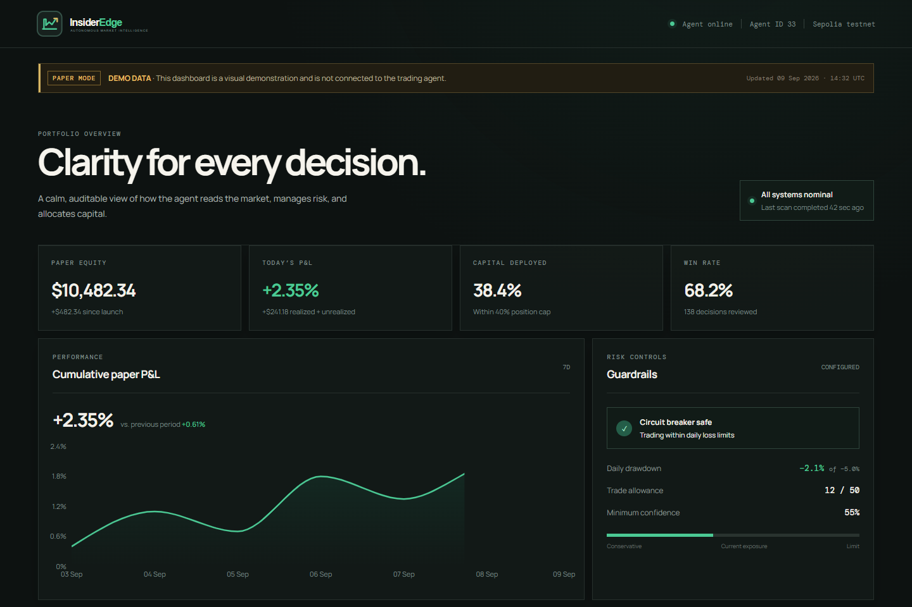
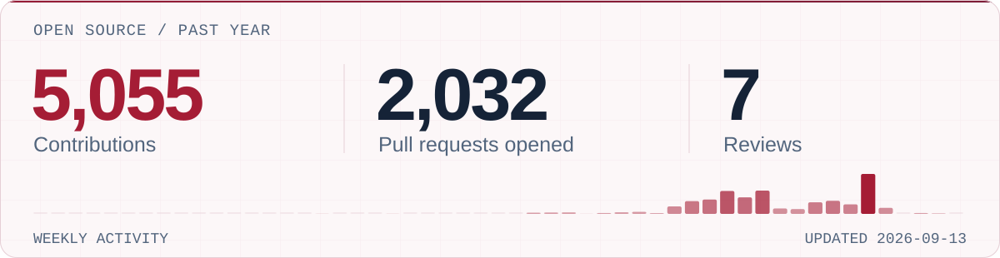

<picture>
  <source media="(prefers-color-scheme: dark) and (max-width: 600px)" srcset="assets/hero-mobile-dark.svg">
  <source media="(max-width: 600px)" srcset="assets/hero-mobile-light.svg">
  <source media="(prefers-color-scheme: dark)" srcset="assets/hero-dark.svg">
  
</picture>

# Hi, I'm Anmol.

I build browser extensions and AI tools, and contribute to open source. I'm especially interested in backend systems and practical uses of AI.

**GSSoC 2026 — Rank #13**

[Projects](#selected-projects) · [Toolkit](#technical-toolkit) · [LinkedIn](https://www.linkedin.com/in/anmol-patel-481b54289)

## Selected projects

### FocusTube

A browser extension that hides YouTube recommendations, comments, and other distractions while keeping the video visible. Focus mode survives YouTube's single-page navigation, with per-tab state stored using Chrome's session storage.

**JavaScript · Manifest V3**  
[Source code](https://github.com/Xenon010101/FocusTube) · [Install for Edge](https://microsoftedge.microsoft.com/addons/detail/cjhibbneibhhcjiiekbhfgiilhijgibo)

### InsiderEdge

A Python crypto-trading agent with a React monitoring dashboard. It includes a Binance-to-CoinGecko data fallback and checks for position limits and daily losses.

**Python · React · Groq · Web3.py**  
[Source code](https://github.com/Xenon010101/InsiderEdge) · [Dashboard demo](https://xenon010101.github.io/InsiderEdge/)

Actual dashboard screenshot. The public demo uses fixed data and is not connected to the trading agent.

### Other repositories

- **[MySTOCKLIST](https://github.com/Xenon010101/MySTOCKLIST)** — An Indian stock tracker with live updates and watchlists.
- **[ArogyaAI](https://github.com/Xenon010101/ArogyaAI)** — An experimental healthcare assistant.
- **[Maze Game](https://github.com/Xenon010101/Maze-Game)** — A game with dynamic maze generation.
- **[PresentAI](https://github.com/Xenon010101/presentai)** — My fork of [a presentation-feedback prototype](https://github.com/Aman-bit1/presentai), with a React/Express upload flow and simulated evaluation scores.

[All repositories](https://github.com/Xenon010101?tab=repositories)

## GitHub activity

<!-- ACTIVITY:START -->

<picture>
  <source media="(prefers-color-scheme: dark) and (max-width: 600px)" srcset="assets/activity-mobile-dark.svg">
  <source media="(max-width: 600px)" srcset="assets/activity-mobile-light.svg">
  <source media="(prefers-color-scheme: dark)" srcset="assets/activity-dark.svg">
  
</picture>

GitHub's past-year window · 2025-09-07 to 2026-09-10 · <a href="assets/activity.json">Snapshot data</a>
<!-- ACTIVITY:END -->

## Technical toolkit

| Area | Tools |
| :--- | :--- |
| Languages | C · C++ · Python · JavaScript · Dart |
| Applications | React · Node.js · Express · Flutter |
| Data | MySQL · Firebase |
| Infrastructure | Git · Linux · Docker · CI/CD |

I'm currently learning more about AI agents, backend architecture, and React Native.

## Get in touch

For project questions or collaboration, reach me on [LinkedIn](https://www.linkedin.com/in/anmol-patel-481b54289).

  
Contribution snake

   
  <picture>
    <source media="(prefers-color-scheme: dark)" srcset="https://raw.githubusercontent.com/Xenon010101/Xenon010101/output/github-contribution-grid-snake-dark.svg">
    
  </picture>
  
<a href="https://github.com/Xenon010101">View my GitHub activity</a>

